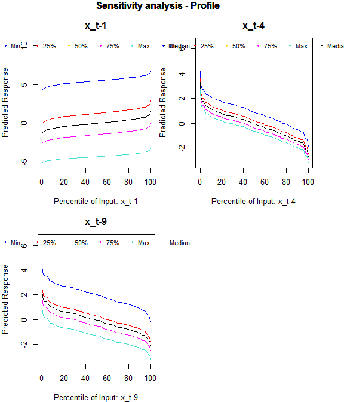
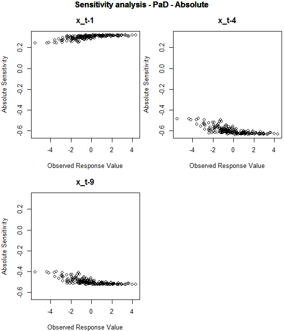

validann
--------

The **validann** package provides validation methods for the replicative, predictive and structural validation of artificial neural network (ANN) models. These methods are applicable to single layer MLPs developed both within the R environment (using functions `ann` or `nnet`) or using alternative software.

### Citation

Please cite this package as follows:

*Humphrey G.B. (2016) validann: Validation Tools for Artificial Neural Networks. Version 1.0.0.*

### Functions

The package includes three core functions: `validann`, `plot.validann` and `ann`, which are breifly described below. A sample dataset (ar9) is also provided for use with the examples.

The `ann` function is a method for training single hidden layer MLPs with a specified model structure (i.e. number of hidden layer nodes, hidden and output layer activation functions).

``` r
library(validann)
# load ar9 data and select input (x) and output (y) data
data(ar9)
samp <- sample(1:1000, 200)
y <- ar9[samp, ncol(ar9)]
x <- ar9[samp, c(1,4,9)]

# fit ANN model with 1 hidden node, tanh activation on the hidden layer
# nodes and linear activation on the output node.
fit <- ann(x, y, size = 1, act_hid = "tanh", act_out = "linear", rang = 0.1)
```

This function is similar to the available `nnet` function from package [nnet](https://cran.r-project.org/web/packages/nnet/index.html); however, it gives greater flexiblity by providing a choice between four alternative activation functions for the hidden and output layer nodes, including the logistic sigmoid, hyperbolic tangent (tanh), linear (or identity) and exponential functions, as well as allowing a user-defined error or objective function. More importantly, in the context of ANN validation, this function returns partial derivatives of the hidden and output node outputs with respect to their inputs, enabling computation of absolute and relative input sensitivities using the PaD structural validation method.

Function `validann` computes validation metrics and statistics for a fitted ANN model according to the class of ANN model (if supplied) and the data provided. These include goodness-of-fit metrics; summary statistics of the observed and simulated datasets and the model residuals; input relative importance measures computed using Garson's, the connection weight (CW), modified connection weight (MCW), Profile and PaD methods; and profiles of model output behaviour produced by the Profile and PaD sensitivity analysis methods.

``` r
# get validation results for ANN model 'fit'. Input data 'x' required for 
# sensitivity analyses
results <- validann(fit, x = x)
```

The `plot.validann` function is a plot method for objects of class \`validann' that produces a series of plots according to the components of the validann object supplied. By default, the plots produced are grouped into goodness-of-fit, residual analysis and sensitivity analysis plots, with multiple plots to a page, as follows:

-   Goodness-of-fit plots (predictive, replicative validation): scatter and Q-Q plots of observed versus predicted data and observed and predicted data against data order.
-   Residual analysis plots (replicative validation): histogram and normal probability plot of residuals; residual autocorrelation and partial autocorrelation plots; standardised residuals against predicted data and standardised residuals against against order of the data.
-   Sensitivity analysis plots (structural validation): Profile sensitivity plots: for each input, plots of predicted response versus percentile of input; PaD sensitivity plots: for each input, plots of relative and absolute sensitivity versus observed response.

``` r
# get observed and fitted (training) data
obs <- observed(fit)
sim <- fitted(fit)
# plot ANN validation results
plot(results, obs, sim)
```

    
